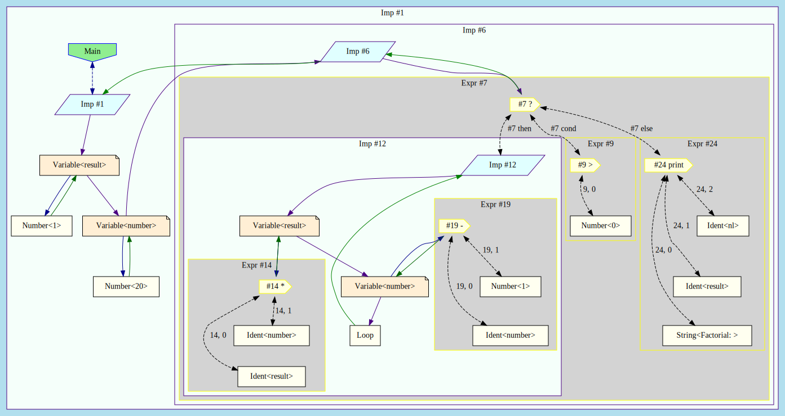

(https://html-preview.github.io/?url=https://github.com/DusteDdk/slisp/blob/master/wasmrepl/html/samples/fac.html)

(https://html-preview.github.io/?url=https://github.com/DusteDdk/slisp/blob/master/wasmrepl/html/samples/perspect.html)